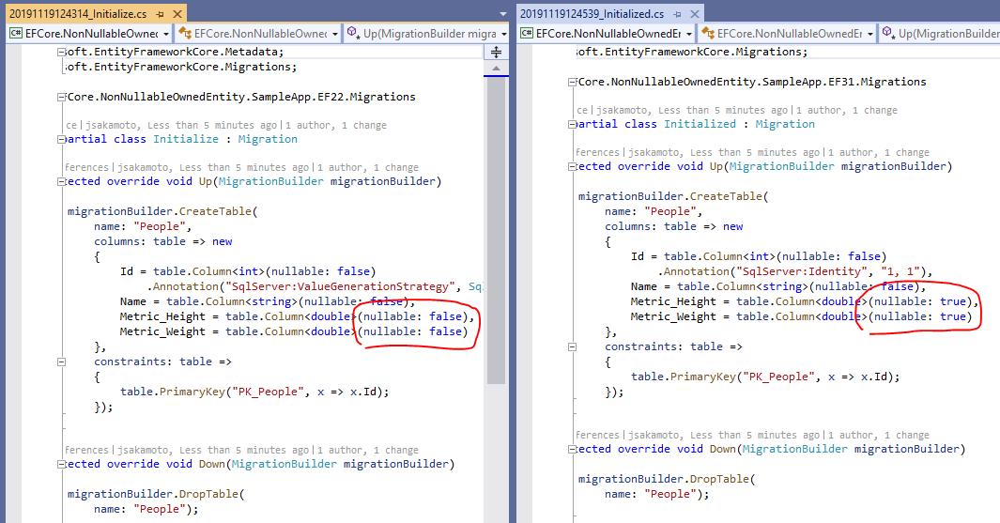

# Sample App - EntityFramework Core - Non-Nullable Owned Entity

## Summary

This sample source code is to reproduce my problem.

See also:

- [aspnet/EntityFrameworkCore - Issue #16943 - "[Required]/IsRequired() on properties of owned entities is ignored"](https://github.com/aspnet/EntityFrameworkCore/issues/16943)
- [aspnet/EntityFrameworkCore - Issue #12100 - "Enable configuring required 1-to-1 dependents"](https://github.com/aspnet/EntityFrameworkCore/issues/12100)

**Please vote 👍 [#12100]((https://github.com/aspnet/EntityFrameworkCore/issues/12100))!**

## What's the problem?

My `DbContext` class has the "People" DbSet like this.

```csharp
public class Person
{
  public int Id { get; set; }
  ...
  public Metric Metric { get; set; }
}
```

The `Metric` class is owned entity, like this.

```csharp
[Owned]
public class Metric
{
  public double Height { get; set; }

  public double Weight { get; set; }
}
```

When I generate the database from these model on EFCore v.2.x, the `Metric_Height` and `Metric_Weight` columns on the table are non-nullable type, expectedly.

However, when I do the same task on EFCore v.3.x, those columns **are not non-nullable** type.



## License

[The Unlicense](LICENSE)